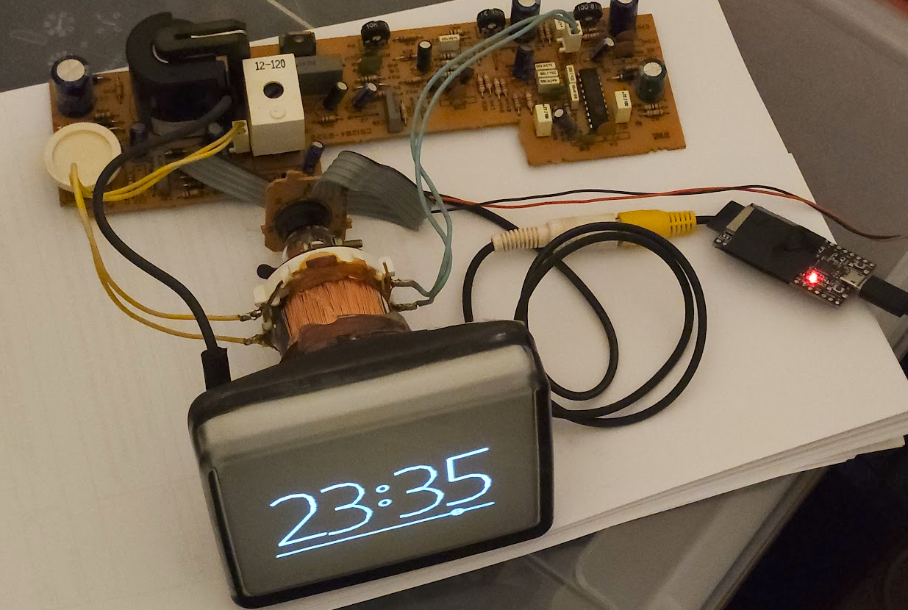
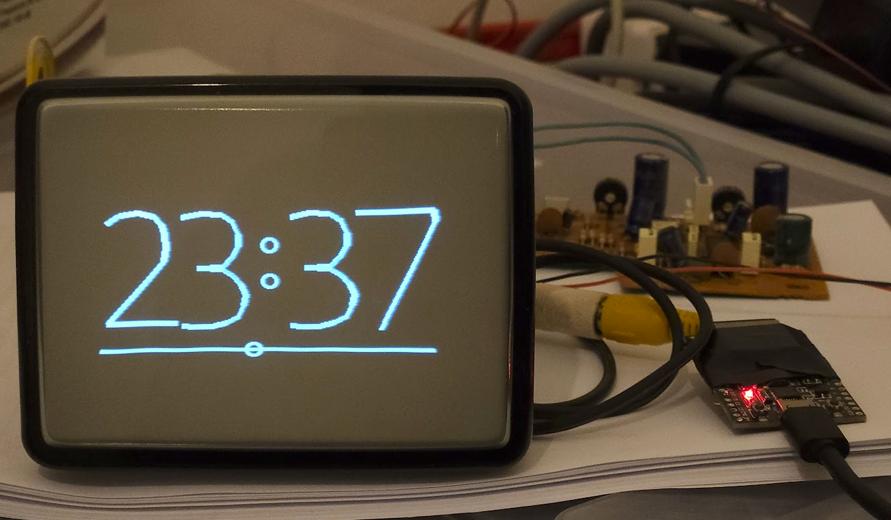

# EP32-CRT: ESP32 Composite Video Clock

A retro-style analog clock application that generates composite video output directly from an ESP32 microcontroller, displaying time via a CRT television screen.

## Overview

This project demonstrates the capabilities of the ESP32 to generate composite video signals without any external hardware. It creates a beautiful analog clock display that syncronizes time via NTP (Network Time Protocol) and outputs the signal over GPIO25 to any device with composite video input.

| | |
|---|---|
|  |  |

## Features

- **Composite Video Output**: Direct PAL video signal generation from ESP32
- **320×240 Resolution**: Clear and retro 8-bit style graphics
- **NTP Time Synchronization**: Automatic time sync via WiFi and internet NTP servers
- **Analog Clock Display**: Elegant time visualization with:
  - Large vector-based numerals showing hours and minutes
  - Moving time indicator cursor that advances with seconds
  - Decorative colon separators with circular design
  - Animated baseline with smooth filtering
- **WiFi Enabled**: Connects to your local network for accurate timekeeping
- **Low Resource Usage**: Optimized for ESP32 with minimal memory footprint

## Hardware Requirements

- **ESP32 Development Board** (ESP32-DevKit recommended)
- **Composite Video Display** (CRT TV or composite video monitor)
- **RCA/CINCH Cable** for video connection
- **5V Power Supply** for the ESP32

### Wiring

Connect the ESP32 to your composite video display:
- **GPIO25** → RCA Video Input (center pin)
- **GND** → RCA Ground (outer metal ring)

## Software Components

### Core Libraries

1. **ESP32 Composite Video Library** (`lib/esp32_composite_video_lib/`)
   - Generates PAL/NTSC composite video signals
   - Supports multiple resolutions and pixel formats
   - No external hardware required
   - Supports LVGL graphics library integration

2. **ESP32Time Library** (`lib/ESP32Time/`)
   - Real-time clock management
   - NTP synchronization
   - Timezone support with DST

### Application Code

- **main.cpp**: Main application loop, time display logic, and frame rendering
- **graphics.cpp/graphics.h**: Graphics primitives (circles, lines, rectangles)
- **vector_font.h**: Vector-based font rendering for crisp, scalable text

## Build and Upload

### Prerequisites

- PlatformIO IDE or PlatformIO CLI
- ESP32 board support
- CMake

## Display Features

### Time Display
- Hours and minutes shown in large vector numerals
- Seconds precision with animated cursor along baseline
- Low-pass filtering for smooth cursor movement

### Visual Elements
- **Colon Separators**: Decorative circular elements separating hours and minutes
- **Baseline**: Animated line showing second-level precision
- **Cursor**: Moving indicator that smoothly advances with each passing second

## Technical Specifications

- **Video System**: PAL (625 lines, 25 fps)
- **Resolution**: 320×240 pixels
- **Pixel Format**: 8-bit Greyscale
- **Pixel Clock**: 7.357 MHz
- **GPIO Pin**: GPIO25 (composite video output)
- **Update Rate**: Per-frame synchronization with 25 fps

## Power Consumption

- Typical: ~200-300mA at 5V
- Depends on WiFi usage and CPU load

## License

This project uses:
- **ESP32 Composite Video Library**: GNU General Public License v3.0
- **ESP32Time Library**: Licensed under included library terms

## Troubleshooting

### No Video Output
- Verify GPIO25 is connected to composite video input
- Ensure proper GND connection
- Try a different video cable or display
- Check display is set to composite/AV input

### Time Not Updating
- Verify WiFi connection in serial monitor
- Check internet connectivity
- Ensure NTP server is reachable (pool.ntp.org)
- Verify timezone string is correct

### Flickering Display
- Reduce other WiFi/network activity
- Ensure stable 5V power supply
- Check GPIO25 cable for interference

## Future Enhancements

- Add color support (RGB composite video)
- Add buttons for manual time adjustment
- Add date display
- Add temperature sensor display
- Add configuration web interface
- Support multiple clock styles/themes

## References

- [ESP32 Composite Video Library](lib/esp32_composite_video_lib/README.md)
- [PlatformIO Documentation](https://docs.platformio.org/)
- [ESP32 Arduino Framework](https://github.com/espressif/arduino-esp32)
- POSIX Timezone Format: https://phpsecu.re/tz/

---

Created for retro computing enthusiasts and IoT developers who appreciate the charm of CRT displays.
